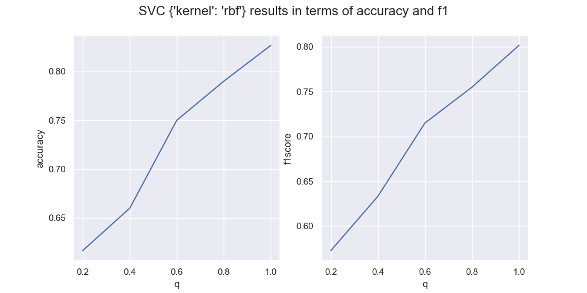

# Машинное обучение для задач информационной безопасности.
## Лабораторная работа №2. Методы стеганоанализа
Выполнили:
- Килбас И.А., группа 6231-010402D
- Мухин А.В., группа 6233-010402D

## Вариант
- НЗБ встраивание {запись по псевдослучайным координатам}, {1 битовая плоскость}. Релевантные функции:
    - `get_1_binary_plane`, `insert_noise`
- Собственный набор признаков. Используются отсчеты дискретного преобразования Фурье. Релевантные функции:
    - `extract_features`

## Собственный набор признаков
Предпосылка: первая битовая плоскость содержит информацию, что закодирована в пространственной области (имеется корреляция соседних отсчетов). Как правило основная часть информации представляет собой низкочастотный сигнал (относительно плавные перепады яркости в силу особенностей геометрии естественных объектов). Напротив, шум является высокочастотным сигналом. 

Учитывая данную предпосылку, спектры естественных изображений и шума (или зашумленных изображений) должны ощутимо отличаться. Пользуясь данным выводом, в качестве признаков будут использоваться **спектральные отсчеты результата ДПФ**.

## Классификатор
Выбору лучшей модели для решения задачи бинарной классификации посвещено отдельное исследование заключающееся в переборе наиболее частоиспользуемых методов машинного обучения. Результаты данного эксперимента в терминах метрик `accuracy` и `f1score` приведены в excel таблица расположенных в папке [`results`](./results/).

## Результаты классификации
Далее на рисунке представлены результаты классификации методом SVM с ядром  $\exp(-\gamma \|x-x'\|^2)$ в терминах метрик `accuracy` и `f1` в зависимости от параметра заполненности контейнера `q`

